# Internet des objets (IOT) version Arduino Uno R4 Wi-Fi BUT3-S5 ESE R5-10 ESE 
## A. DeCarvalho

## Outils : 
- Visual Studio Code
  - PlaformIO
-  Arduino Uno R4 Wifi

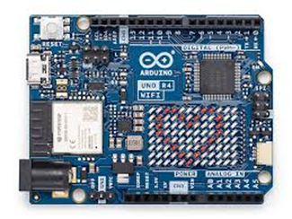

   -  PCT2075
  
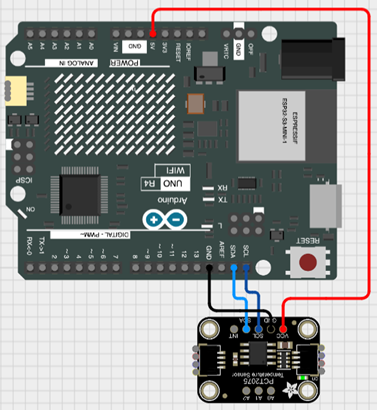

   -  DHT22
  
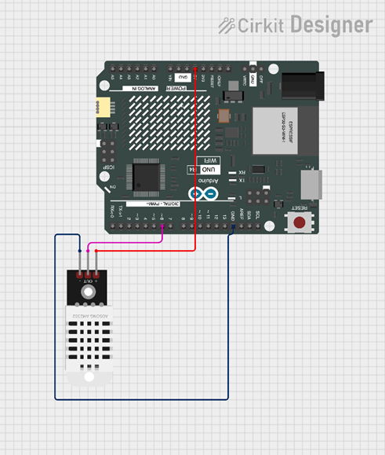

   -  OLED 1306 0.96" monochrome I2C 32x64
  
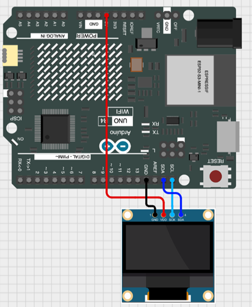

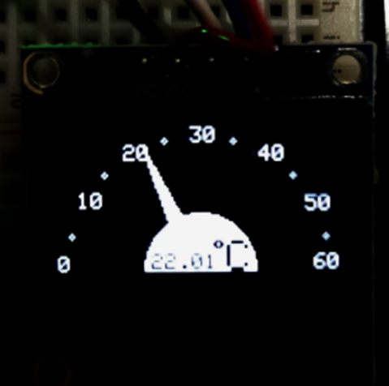

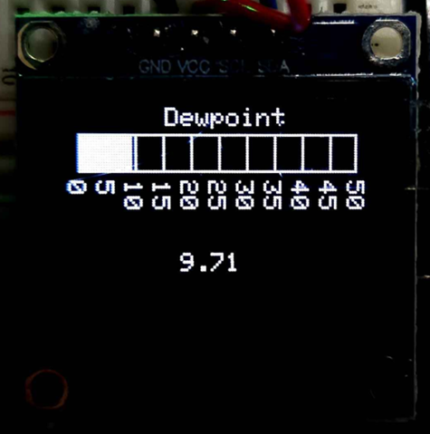

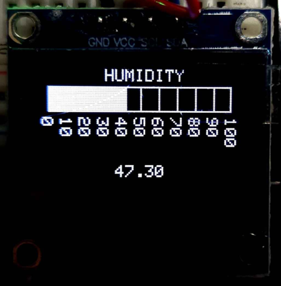

   -  OLED SSD1351 1.5" RGB SPI 128x128
  
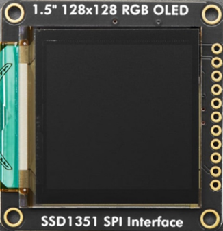

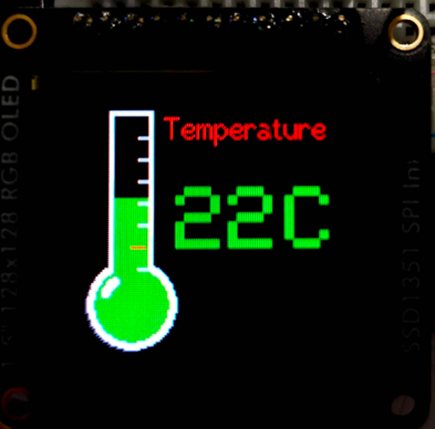

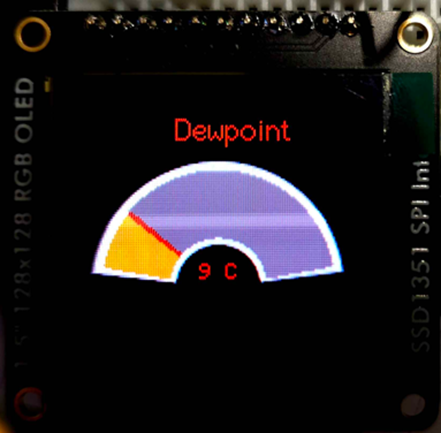

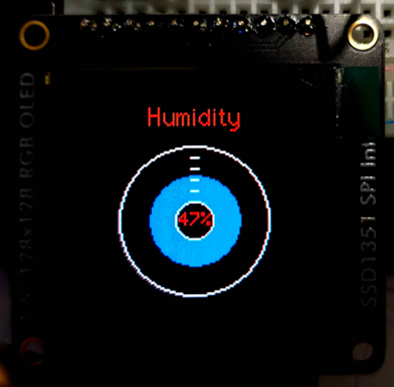

-  Raspberry Pi 4B

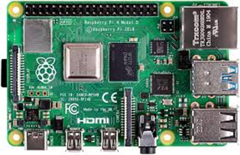

   -  NODE-RED : MQTT + USB
  
  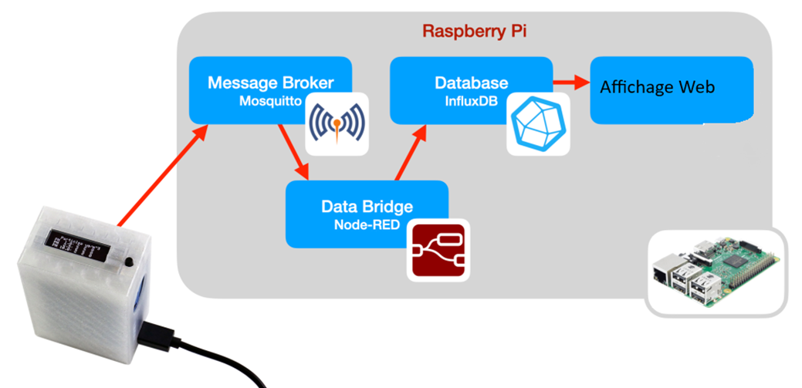

  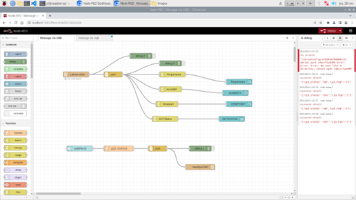

  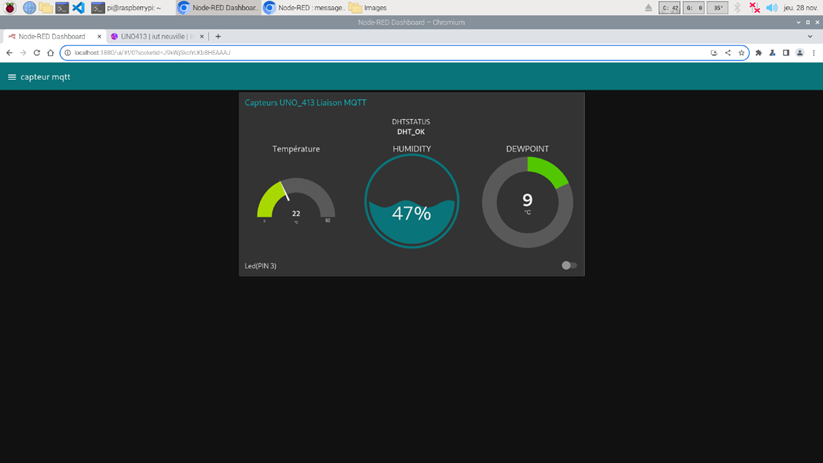

   -  Influx_DB (database)

  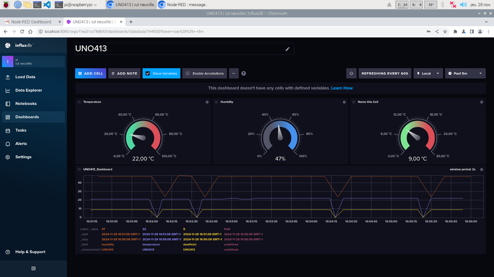

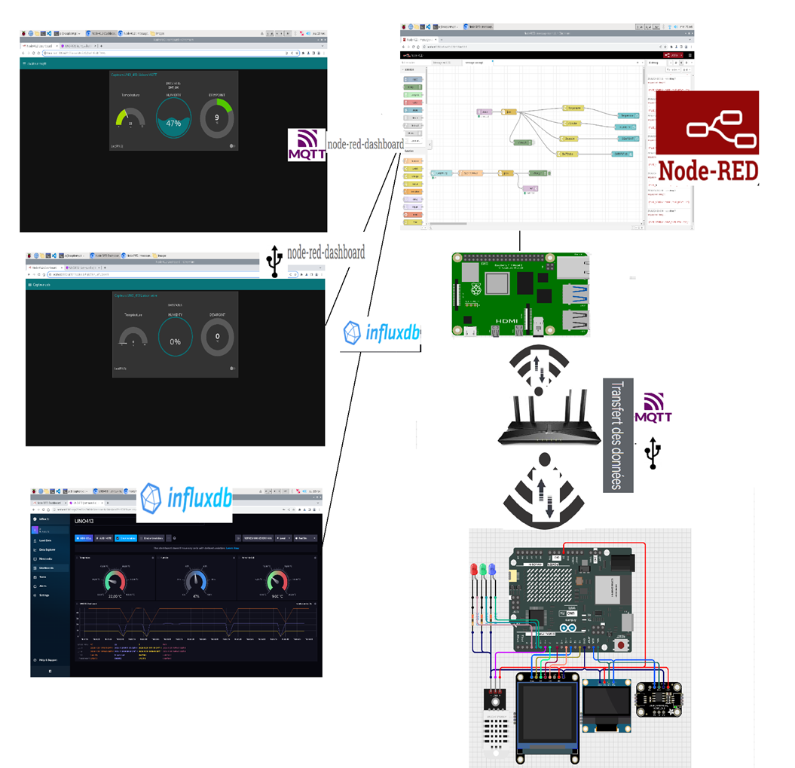

# PCB :
 - ## [Lien Dossier PCB](PCB_Proteus)

# Documentation
- ## [Lien Documentation](https://github.com/A-s-a-d/IOT_Arduino_Raspberry_PI/blob/main/Documentation/Compte-rendu-Syst%C3%A8me-IoT-Connect%C3%A9.pdf)
